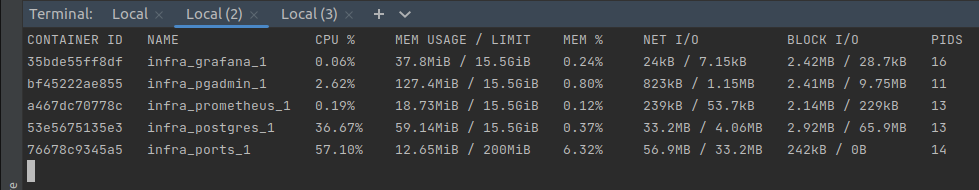
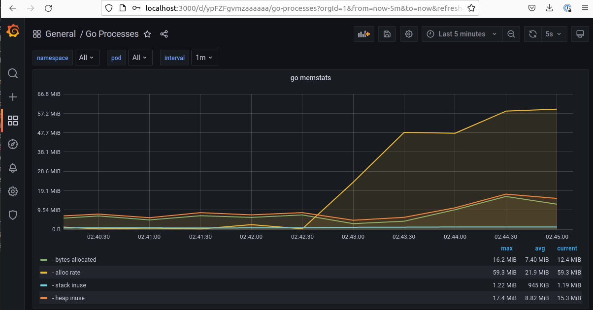
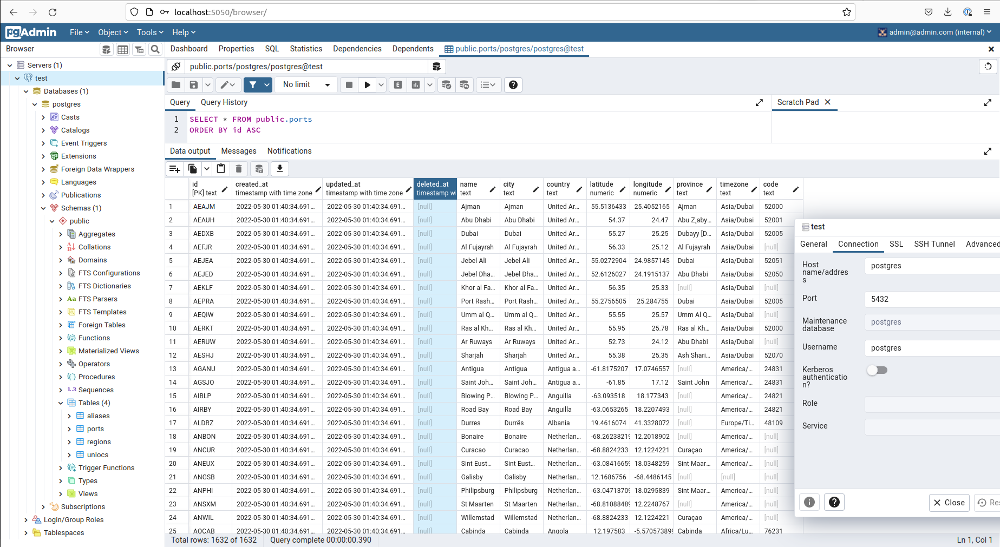
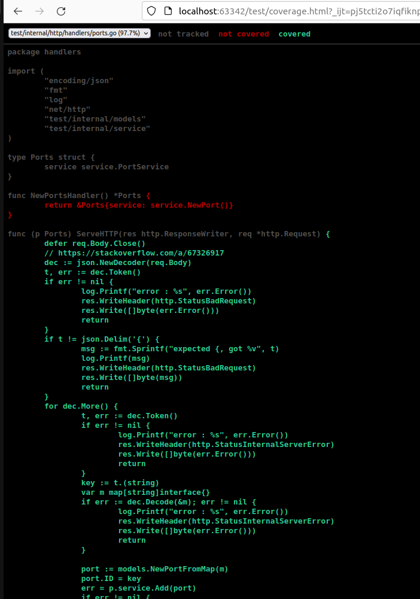

### Running

from the `infra` folder run `docker compose up -d --build`
> Works on my machine ©

### Usage

from the `infra` directory execute the following command to make a request to the test server:
```shell
curl --location --request POST 'http://localhost:8080/ports' --header 'Content-Type: application/json' -d @ports.json
```

### TODO
- [ ] More tests
- [ ] Table tests
- [ ] Better logging library
- [ ] Other CRUD endpoints
- [ ] Configure the application via environment variables 
- [ ] Metrics middleware is not saving the http status as a label 

### Disclaimer
I spent a LOT more than 2 hours, sorry.


#### docker stats



#### Grafana



#### PGAdmin



#### Coverage

